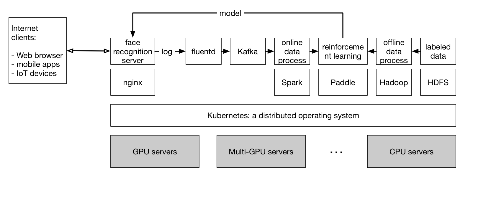
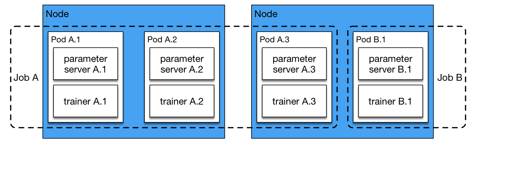

# Figures

Run the following command to list figures in README.md:

```bash
cd figures
./generate-thumbnails.bash
```
#### paddle-cloud-design.png 
#### paddle-cloud-in-data-center.png 
#### paddle-notebook-cloud.png 
#### paddle-on-kubernetes-invited-blog-jobs-pods.png 
